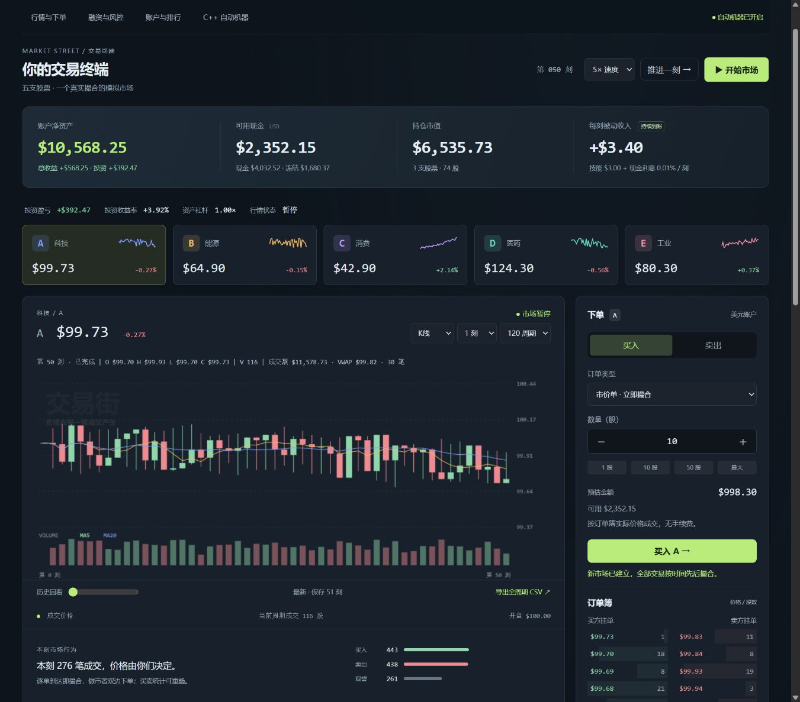
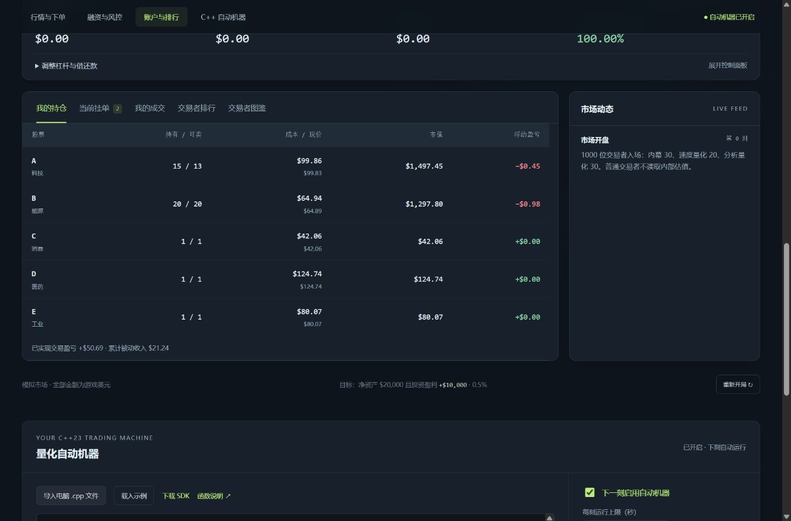
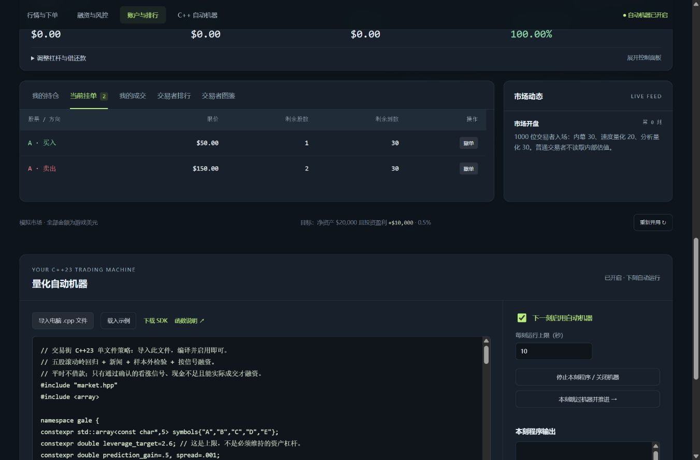
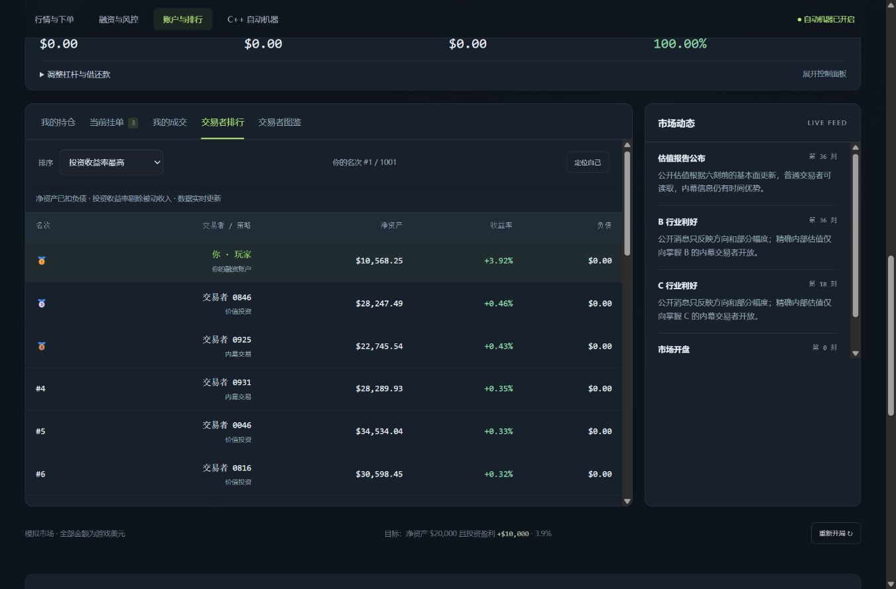
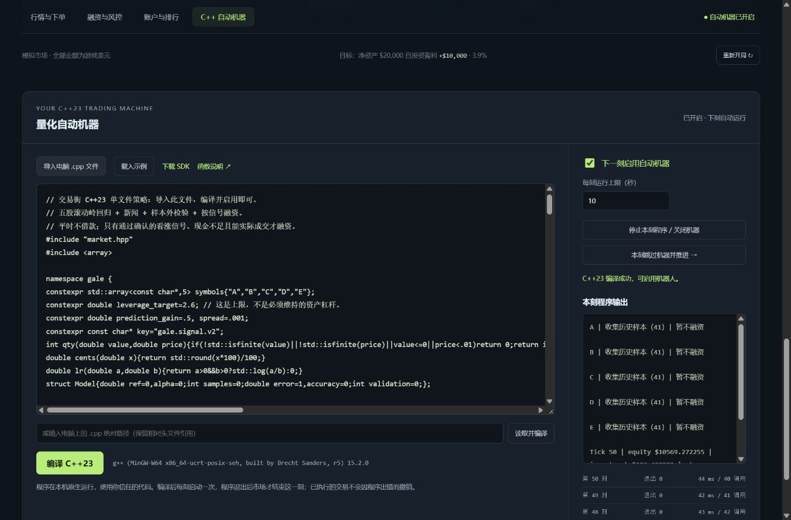

<div align="center">

# ↗ 交易街 · Market Street

### 五支股票，千名对手。把你的交易想法写成代码，放进市场里见真章。

**本地运行 · 千人订单簿 · K 线与排行 · 融资与强平 · C++23 策略机器**


[开始游戏](#三分钟上桌) · [怎么玩](#怎么玩) · [策略开发](#把策略写成-c23) · [截图](#看看交易终端) · [市场规则](市场机制详解.md)

</div>



## 一座会交易的小城

开局拿到 **$10,000 游戏美元**，与默认 **1,000 名交易者**一起买卖 A–E 五支股票。每个周期，他们会根据估值、趋势、库存和各自的信息选择下单、买卖或观望。

**成交产生价格。** 你的订单会进入同一个限价订单簿，按价格优先、时间优先寻找对手。限价单可能成交，也可能等到过期；流动性不足时，再好的想法也不一定能执行。

市场中有少量内幕交易者，掌握部分股票的内部估值；有抢先行动的速度派量化；也有使用回归、EMA、RSI 和布林带的分析派量化。你可以手动盯盘，也可以把自己的策略编译成 C++23 程序，让代码逐刻出场。

## 值得玩什么

| 玩法 | 你能做什么 |
|---|---|
| **真实订单簿撮合** | 市价吃单、限价挂单、撤单、观察同价排队；撮合跳过自成交 |
| **50–5000 名对手** | 开局设置人数和种子，在不同市场规模中试验你的交易思路 |
| **八类交易者** | 与价值、趋势、逆向、做市、投机、内幕、速度量化、分析量化竞争 |
| **完整行情历史** | K 线、收盘线、成交量、MA5/MA20、OHLC、VWAP、多周期聚合、历史回看与 CSV 导出 |
| **三种排行榜** | 净资产、总收益率、剔除被动收入后的投资收益率；定位自己、分页查看 |
| **最高 3× 融资** | 借款、还款、利息、保证金和真实买盘强平；控制风险也是玩法的一部分 |
| **可编程交易机器** | 导入 `.cpp` 或电脑路径，编译后每个周期启动新进程；可启停、跳过和跨回合记忆 |
| **完整数据 SDK** | 查询公开盘口、新闻、交易者和成交档案，以及自己的成本、冻结资产和资金流水 |

## 三分钟上桌

### 1. 准备环境

- **手动游玩：** Windows + Node.js 22 或更新版本。
- **C++ 自动策略：** 另外准备支持 C++23 的 `g++` 或 `clang++`。项目在 g++ 15.2 上验证过。
- 服务端只使用 Node.js 自带模块，**不需要 `npm install`**。手动游玩不需要 C++ 编译器。

### 2. 下载并启动

在 GitHub 点击 **Code → Download ZIP**，解压后双击根目录：

```text
启动炒股游戏.bat
```

浏览器会自动打开本机页面。保留启动窗口，默认地址为 `http://127.0.0.1:8765`；端口已占用时会使用后续端口，以启动窗口显示的地址为准。

也可以从项目根目录运行：

```shell
node market-game/server.cjs
```

### 3. 创建你的市场

设置人数和可选随机种子，点击「创建市场」。从一笔小单开始，或直接导入项目附带的 C++ 策略。

> 游戏数据保存在服务端内存中。同一标签页刷新可以恢复本局；关闭服务或重新开局会结束本局。目前没有磁盘存档功能。

## 怎么玩

**目标：净资产达到 $20,000，同时获得至少 $10,000 的投资盈利。** 投资盈利会剔除技能收入和现金利息，并包含融资成本，不能靠挂机领取收入通关。

1. **观察行情。** 选择 A–E，查看 K 线、成交量、公开估值、消息和订单簿。
2. **决定怎么下单。** 市价单按真实对手盘成交，剩余数量取消；限价单先尝试撮合，剩余部分挂单。买单冻结美元，卖单冻结股份，可随时撤单。
3. **推进时间。** 点击「推进一刻」慢慢研究，或「开始市场」自动推进；支持速度切换。
4. **管理融资。** 选择 2×/3× 融资档位，再按需借款。借款增加现金和负债，不增加净资产。看跌时卖出减仓；游戏不支持卖空。
5. **检验成绩。** 看持仓、成交、投资盈亏和排行，也可以导出行情或编写策略做重复实验。

| 关键规则 | 数值 / 行为 |
|---|---|
| 初始玩家净资产 | $10,000 |
| 股票 | A 科技、B 能源、C 消费、D 医药、E 工业 |
| 现金利息 | 每刻 0.01% |
| 玩家技能收入 | 每刻 $3 |
| 融资利息 | 每刻 0.05%，计入负债 |
| 保证金强平线 | 净资产 ÷ 总资产低于 25% |
| 强平恢复线 | 恢复到 35% 后停止减仓；无买方时保留持仓，后续重试 |
| 公开行业消息 | 每 18 刻发布；方向公开、内部估值不公开 |
| 公开估值报告 | 每 36 刻更新，基本面信息滞后 6 刻 |

## 看看交易终端

### 账户与持仓：钱在哪里，一眼看清



### 挂单与撤单：等待成交，也要管理资金占用



### 千人排行：和同一座市场里的对手比成绩



### C++ 自动机器：编译、启停、日志和逐刻运行记录



以上是实际运行界面的截图，不是设计稿；截图中的账户成绩仅代表对应演示局。

## 把策略写成 C++23

在网页底部「量化自动机器」导入 `.cpp`，或输入电脑文件的绝对路径，点击编译，然后勾选「下一刻启用自动机器」。SDK 头文件 `market.hpp` 会由游戏自动加入编译搜索路径。

```cpp
#include "market.hpp"

int main() {
    try {
        const auto a = market::account();
        const auto b = market::book("A");
        if (!a.liquidating && a.shares[0] < 10 &&
            !b.sell.empty() && a.available_cash > b.sell[0].price) {
            const auto r = market::buy("A", 1);
            market::log(r.message);
        }
        return 0;
    } catch (const std::exception& e) {
        market::log(e.what());
        return 1;
    }
}
```

每刻程序运行一次，`main()` 退出后，普通交易者继续交易并完成本刻。速度派会在玩家程序之前行动。每刻是新进程，普通变量不保留；用 `memory_get/set` 保存策略状态。

默认限时 10 秒，可设为 1–120 秒；每刻最多 2000 次接口调用、2 MB 输出。超时或异常会关闭机器，已完成的交易保留。C++ 程序在本机原生运行，具备普通程序的文件和网络权限，因此请只编译自己信任的代码。

**现成策略：**

- [价差猎手.cpp](价差猎手.cpp)：围绕五刻 VWAP 做窄价差交易，默认不主动借款。[说明](价差猎手说明.md)
- [疾风量化.cpp](疾风量化.cpp)：滚动岭回归、新闻和逐点向前验证；只有强看涨信号、预期收益覆盖成本、现金不足且存在可成交卖盘时才融资。信号失效就减仓还款。[说明与测试结果](疾风量化说明.md)
- [example.cpp](market-game/strategies/example.cpp)：从均线和小额下单开始，适合学习 SDK。

自动寻找编译器失败时，可在启动前设置 `MARKET_CXX` 为编译器可执行文件的完整路径。

## 给喜欢研究的人

**不只看到一个价格，还能查看它如何形成。**

```cpp
auto own = market::player_info();          // 成本、冻结、可卖股份、浮盈等
auto orders = market::raw_book("A", 100);  // 逐笔挂单、价格、时间、所有者
auto prints = market::trades(100, 0, "A"); // 公开逐笔成交
auto feed = market::events(100);           // 新闻方向、内容与发布时间
auto bars = market::history("A", 200);     // 注意过滤未完成周期
auto cashflow = market::ledger(100);       // 私人借还款、利息、收入与交易流水
```

完整档案支持分页；相关接口的 `count=0` 可取全部。查询采用公开字段列表，玩家拿不到 NPC 的内部估值、随机状态或未来决策。

[完整 SDK 文档](market-game/sdk/README.md) · [撮合与市场机制详解](市场机制详解.md) · [游戏说明](游戏说明.md)

## 一个测试结果，供你挑战

「疾风量化」在 **1,000 名 NPC、种子 20261005、1,200 刻** 的可复现实验中，从 $10,000 获得 **$12,806.46 投资盈利**，投资收益率 **128.06%**，第 999 刻达成目标。该实验没有满足融资条件，**全程没有借款**；按真实买盘清仓后的投资盈利为 $12,787.99。

这是一组游戏模拟结果，已剔除被动收入，不代表其他种子或其他版本的表现，也不是现实投资收益预测。想试试能否超过它？选择相同种子，写一份自己的策略。

## 开发与验证

核心：Node.js 本地服务 + 原生 HTML/CSS/Canvas 前端 + 单文件 C++ SDK。无需前端构建工具和外部数据服务。

```text
market-game/engine-v2.cjs       订单簿、NPC、周期、融资与强平
market-game/controller.cjs      游戏会话与 SDK 查询/交易接口
market-game/data-api.cjs        公开字段与自己账户的数据接口
market-game/bot-runtime.cjs     C++ 编译、进程协议、限时与输出
market-game/dist/               网页前端
market-game/sdk/                C++ 头文件与 API 文档
market-game/strategies/         示例、策略验证与实验记录
```

```shell
node market-game/test-v2.cjs
node market-game/strategies/test-data-api.cjs
node market-game/strategies/test-ui-state.cjs
node market-game/strategies/test-gale-signals.cjs
node market-game/strategies/test-output.cjs
```

策略回测：`node market-game/strategies/verify-gale.cjs`；长期实验追加 `--long`。程序构建产物会写到被 Git 忽略的 `market-game/runtime/`。

欢迎通过 Issues 提出市场机制、UI 或 SDK 建议，也欢迎提交策略与改进。喜欢这个小市场的话，给它一颗 ⭐，让更多人的交易想法在这里交锋。
